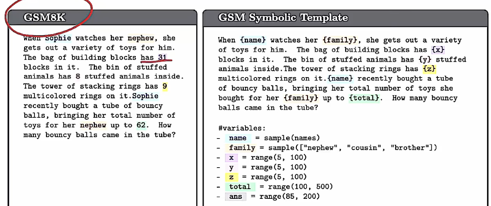

**Model soup for better rlhf:  FOR BETTER RLHF: WEIGHT SPACE AVERAGING TO IMPROVE ALIGNMENT IN LLMS**

This paper propose an intersting idea that they tried to use model soup in order to make the neural network explore more in the space. Their focus is on the change the reference distribution. Does not directly make the nn explore more in the space. 
Dataset: MT-Bench, Arena-Hard, UltraFeedback 
LLM as judge (Judging llm-as-a-judge with mt-bench and chatbot arena)

This paper guid me to another one: ReaL: Efficient RLHF Training for LLMs
with Parameter Reallocation. 貌似是做PPO加速的。

This paper guide me to another one: GRPO. 
GRPO最开始是为了提升在数学推理上的进步。

**GSM-Symbolic**: recreate the dataset so it could fit the numbers. Use the symbolic character to represent the number. After that, they observe the performance drops. 

**Privacy Backdoors: Stealing Data with Corrupted Pretrained Models** 
为了知道这些信息，做了大量的网络参数和配置上面的更改。

don't ask for things negatively. 
我想要什么呢？ 
